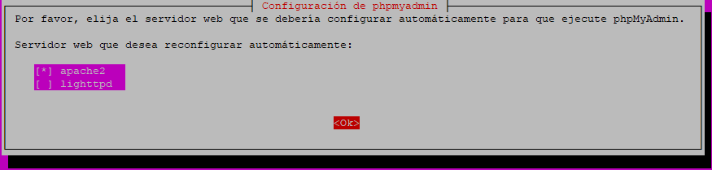
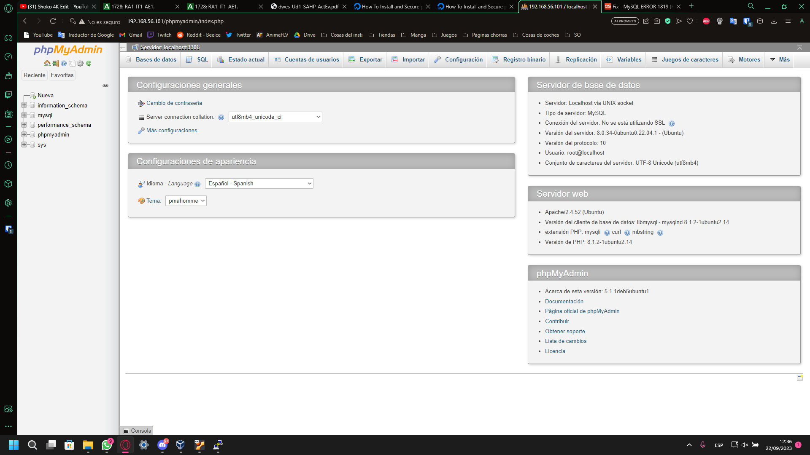

## Practica realizada por: Ángel Cubero Olivares

### Actividad 1: Instalar y configurar Xampp, probar el servidor con phpmyadmin y probar el servidor creando un porfolio basico


#### Actividad 2: Instalar virtualbox, crear una maquina con ubuntu server e instalar los paquetes Apache, MariaDB/MySQL, php y phpmyadmin y probar el servidor desde nuestro host
Dado a que la instalación de virtualbox y su uso basico para crear y configurar máquinas vituales ya ha sido tratado reiteradas veces en el módulo "Sistemas infomáticos" dado el año anterior voy a prescindir de su explicación y partiré con una máquina limpia con Ubuntu Server 22.04.3 LTS con los siguientes recursos hardware asignados: 4GB de RAM, 3 núcleos 6 hilos, 30GB de almacenamiento y 2 interfaces de red (una de tipo "NAT" para instalación/ctualización de paquetes y otra de tipo "Host-only" para poder acceder desde mi host al servidor web, ya sea para hacer pruebas desde el navegador o configuralo por SSH).

1. Aclarado lo anterior partimos de la maquina iniciada:


1. Instalamos el servidor y el cliente (para configuración) de MySQL con el siguiente comando:


3. Instalamos el paquete phpmyadmin, php y los complementos de php para que phpmyadmin funcione correctamente con el siguiemte comando:


Ahora indicamos que queremos que el servidor web a instalar para el funcionamiento de phpmyadmin sea apache2, indicamos que queremos hacer la configuración de la base de datos en el fichero dbconfig-common y establecemos las contraseñas que nos solicita:



En caso de que de error tenemos que configurar una contraseña segura para el usuario root en MySQL. Esto podemos hacerlo desde la terminal ejecutando lo siguiente (donde 'password' se sustituye por la contraseña que queramos):


Intentamos reinstalar phpmyadmin, ejecutamos el siguiente comando y reiniciamos el servicio apache2:


4. Probamos el servidor buscando (ip-maquina-virtual)/phpmyadmin desde el host utilizando el navegador y accedemos con el usuario root y la constraseña configurada anteriormente:



#### Actividad 3: Crear un proyecto web que con java calcule el doble de un numero solicitado mediante un formulario HTML usando el IDE Eclipse Enterprise edition y el servidor web apache Tomcat
1. Descargamos el instalador de eclipse en la sigiuente página:
https://www.eclipse.org/downloads/packages/release/2019-06/r/eclipse-ide-enterprise-java-developers 

2. Lo ejecutamos y durante la instalación elegimos la opción "Enterprise EDI for java web proyects". Una vez instalado nos aparecerá en el sistema de la siguiente manera:

3. Iniciamos el programa, creamos un nuevo proyecto web, elegimo el directorio de trabajo e indicamos que queremos usar el servidor web apache Tomcat y que lo instala automáticamente:


4. Creamos los ficheros index.jsp y dobleNServlet.java en las rutas src/main/webapp y src/main/java respectivamente. Cada fichero tiene que contener lo siguiente:


5. Ejecutamos el servidor usando Tomcat y probamos el funcionamiento el la ventana de navegador que se ha abierto autáticamente ejecutar el proyecto:


 

#### Actividad 4: Crear un entorno de trabajo virtual usando Vagrant y el proyecto Laravel Homestead
Vagrant es una herramienta que nos permite crear cajas (maquinas virtuales independientes) mediante un software de virtualización (en este caso virtualbox) y Laravel Homestead es un proyecto que podemos encontrar en github. Este ultimo es una caja pre-empaquetada la cual cuenta con todos los paquetes y la configuración necesarios para poder usar la caja de vagrant como servidor de pruebas local.


##### Aclaración: Debido a serios problemas que he experimentado con la conexion a redes e internet en mi equipo usando el SO de Arch Linux he decidido eliminarlo. Esto ha causado la perdida de todas las capturas de pantalla realizadas para esta actividad, pero indicaré paso a paso lo realizado en ese SO. (Gracias por la comprensión)

1. Instalar de vagrant y dependencias para que funcione y podamos clonar el repositorio Laravel Homestead:
``` bash
sudo pacman -S virtualbox git vagrant
```

2. Creamos la caja de vagrant indicando la opción 3 o la que diga virtualbox, seguido a esto clonamos el repositorio estando dentro de la ruta de trabajo:
``` bash
vagrant box add laravel/homestead
git clone https://github.com/laravel/homestead.git
```
3. Vamos a la carpeta del repositorio, damos permisos y ejecutamos el fichero llamado init.sh:
``` bash
cd homestead
chmod +x ./init.sh
./init.sh
```

4. Creamos el fichero id_rsa en el directorio .ssh dentro del directorio del usuario y que su contenido sea lo siguiente:
sudo nano /home/'usuario'/.ssh/id_rsa
-Contenido (ctrl + o guardar. ctrl + x salir):
ssh-keygen -t rsa -C "correo@correo.es" 

5. Añadimos la siguiente línea al fichero /etc/hosts (datos sacados del fichero Homestead.yml generado en la carpeta de repositorio):
192.168.56.56   homestead.test

6. Ahora dentro de la carpeta del repositorio ejecutamos los siguientes comandos:
``` bash
vagrant up
vagrant ssh (para conectarnos por ssh al servidor virtual)
mkdir code
mkdir code/public
```

7. Ahora dentro del ultimo directorio creado añadimos un fichero index.html con algun contenido básico y lo guardamos.

8. En nuestro equipo buscamos homestead.test desde el navegador y si todo ha salido bien verémos el contenido del HTML creado anteriomente.

9. Por último para apagar el servidor virtual tenemos que ejecutar el siguiente comando dentro del directorio del repositorio:
``` bash
vagrant halt
```
